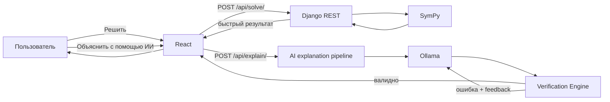

# DiffSolver / Trposite

**DiffSolver** — веб-сервис для решения и проверки обыкновенных дифференциальных уравнений (ОДУ). Проект объединяет детерминированное символьное решение через SymPy, локальное объяснение через LLM, независимую математическую верификацию кандидатов и консенсусную проверку несколькими решателями.

Главная идея проекта — **verified-first**: генеративная модель не считается источником математической истины. Быстрый ответ сначала получает SymPy, а любой AI-кандидат перед показом как проверенного результата проходит независимую многоступенчатую проверку. Если AI допускает ошибку, backend формирует диагностический feedback и запускает ограниченный цикл самокоррекции.

## Возможности

- быстрое решение ОДУ через **SymPy**;
- пошаговое отображение решения и формул в браузере;
- отдельное подробное AI-объяснение через локальную **Ollama / Llama 3**;
- автоматическая самокоррекция AI-ответа при провале математической проверки;
- многоступенчатая верификация решения:
  - нормализация математических выражений;
  - точная символическая подстановка;
  - независимая численная проверка невязки;
  - проверка количества произвольных констант;
  - сравнение с эталонным семейством решения;
  - анализ особенностей области определения;
  - объяснимый confidence score;
- независимая проверка несколькими решателями:
  - SymPy;
  - Ollama;
  - OpenAI, если настроен API-ключ;
  - DeepSeek, если настроен API-ключ;
- группировка математически эквивалентных проверенных решений;
- ранжирование кандидатов на основании математической верификации и межмодельного согласия;
- Django REST API;
- React SPA с MathJax;
- отдельная подсистема истории решений;
- комплексный тестовый кластер: unit, integration, differential, property-based, fuzz, resilience/fault-injection, regression и load testing.

## Ключевой принцип

Обычный пользовательский сценарий не заставляет ждать LLM:



AI используется **по требованию**, а не как обязательный путь получения ответа. Это снижает задержку, уменьшает нагрузку и сохраняет детерминированный математический путь по умолчанию.

## Структура репозитория

```text
trposite/
├── backend/                     # Django + DRF
│   ├── config/                  # конфигурация Django
│   ├── history/                 # модель и API истории
│   ├── solver/                  # API и математическая бизнес-логика
│   ├── manage.py
│   ├── requirements.txt
│   └── requirements-test.txt
├── frontend/                    # React SPA
│   ├── public/
│   ├── src/
│   └── package.json
├── tests/                       # тестовый кластер backend
├── scripts/                     # служебные сценарии
├── docs/                        # подробная документация
├── pytest.ini
└── README.md
```

Полное описание дерева и назначения модулей: [docs/codebase.md](docs/codebase.md).

## Архитектура в одном абзаце

Frontend — React-приложение, которое обращается к Django REST API. Основной endpoint `/api/solve/` синхронно использует `SympySolver`. Endpoint `/api/explain/` вызывает `AIExplanationService`: сервис получает эталон через SymPy, просит Ollama подробно объяснить решение, затем проверяет `solution_expression` через `MultiStageVerificationEngine`; при провале формирует feedback и повторяет попытку не более трёх раз. `/api/consensus/` запускает доступные solver providers параллельно, математически проверяет каждый кандидат, группирует эквивалентные валидные семейства и выбирает лучший результат. Подробности: [docs/architecture.md](docs/architecture.md).

## Реализованный алгоритм

Конкурентная часть проекта состоит из трёх связанных механизмов:

1. **Multi-stage mathematical verification** — независимая проверка сгенерированного решения;
2. **bounded AI self-correction** — возврат диагностических данных модели и повторная генерация после математической ошибки;
3. **verification-gated consensus ranking** — сравнение решений нескольких провайдеров, при котором консенсус повышает рейтинг только уже математически подтверждённых кандидатов.

Несколько одинаковых, но неправильных AI-ответов не могут «переголосовать» единственный корректный результат: математическая валидность является обязательным gate до применения consensus score.

Формальное описание, веса, инварианты и псевдокод: [docs/algorithm.md](docs/algorithm.md).

## Технологии

### Backend

- Python;
- Django;
- Django REST Framework;
- SymPy;
- `requests`;
- OpenAI-compatible Python client;
- `python-dotenv`;
- `django-cors-headers`;
- SQLite в текущей development-конфигурации.

### Frontend

- React 19;
- React Router;
- Axios / Fetch;
- MathJax React;
- Framer Motion;
- Create React App / `react-scripts`.

### Testing

- pytest;
- pytest-django;
- pytest-cov;
- Hypothesis;
- собственный concurrent load probe.

## Требования для локального запуска

Рекомендуется:

- Python 3.12+;
- Node.js 18+;
- npm;
- Ollama — только если требуется AI-объяснение или локальный кандидат consensus;
- модель `llama3` в Ollama — по умолчанию.

Облачные API являются **опциональными**. Без OpenAI/DeepSeek основной SymPy-путь, локальный AI и consensus с доступными провайдерами продолжают работать.

## Backend: установка и запуск

Из корня репозитория:

```bash
python -m venv .venv
source .venv/bin/activate
python -m pip install --upgrade pip
python -m pip install -r backend/requirements.txt
python backend/manage.py migrate
python backend/manage.py runserver
```

По умолчанию Django development server будет доступен на:

```text
http://127.0.0.1:8000/
```

## Frontend: установка и запуск

В отдельном терминале:

```bash
cd frontend
npm ci
npm start
```

Development frontend обычно доступен на:

```text
http://localhost:3000/
```

API URL задаётся переменной frontend-сборки:

```env
REACT_APP_API_URL=http://localhost:8000/api
```

Если она не определена, `frontend/src/api.js` использует `http://localhost:8000/api`.

## Ollama

Для локального AI-пути:

```bash
ollama pull llama3
ollama serve
```

По умолчанию backend ожидает:

```text
http://localhost:11434
```

Настраиваемые переменные:

```env
OLLAMA_BASE_URL=http://localhost:11434
OLLAMA_MODEL=llama3
OLLAMA_TIMEOUT=180
OLLAMA_HEALTHCHECK_TIMEOUT=1.5
```

## Переменные окружения backend

В текущем `backend/config/settings.py` переменная `BASE_DIR` указывает на корень репозитория, поэтому `load_dotenv(BASE_DIR / ".env")` читает файл **`trposite/.env`**. Файл `backend/.env.example` является историческим шаблоном и не определяет фактическое место загрузки `.env`.

Текущая конфигурация и providers используют следующие переменные:

```env
# Опционально: облачные providers
OPENAI_API_KEY=
DEEPSEEK_API_KEY=
# Также поддерживается старое имя:
DEEP_SEEK_API_KEY=

# Ollama
OLLAMA_BASE_URL=http://localhost:11434
OLLAMA_MODEL=llama3
OLLAMA_TIMEOUT=180
OLLAMA_HEALTHCHECK_TIMEOUT=1.5

# Ограничения OpenAI-compatible providers в consensus
LLM_PROVIDER_TIMEOUT=45
LLM_PROVIDER_MAX_RETRIES=1
```

Секреты не следует коммитить в Git. Используйте `.env`, переменные shell, secret storage CI/CD или настройки окружения deployment-платформы.

## Основные API endpoints

| Метод | Endpoint | Назначение |
|---|---|---|
| `POST` | `/api/solve/` | быстрый детерминированный solve через SymPy |
| `POST` | `/api/explain/` | подробное локальное AI-объяснение + verification + self-correction |
| `POST` | `/api/consensus/` | независимое сравнение нескольких решателей |
| `GET` | `/api/result/<job_id>/` | чтение process-local job state для compatibility path |
| `GET` | `/api/history/` | последние сохранённые записи истории |

Минимальный запрос на решение:

```json
{
  "equation": "y.diff(x) - y = 0",
  "variable": "x"
}
```

Подробные контракты API находятся в [docs/codebase.md](docs/codebase.md).

## Синтаксис уравнений

Пользовательский синтаксис соответствует выражениям SymPy, подготовленным проектом для функции `y(x)`.

Примеры:

```text
y.diff(x) - y = 0
y.diff(x) = x * y
y.diff(x, 2) + y = 0
y.diff(x) = sin(x)
```

Текущий normalizer ориентирован на одну независимую переменную и функцию `y`.

## Тестирование

Установка тестовых зависимостей:

```bash
source .venv/bin/activate
python -m pip install -r backend/requirements-test.txt
```

Полный автоматизированный прогон:

```bash
./scripts/run_test_cluster.sh
```

Или напрямую:

```bash
pytest
```

Нагрузочный probe запускается отдельно, когда development server уже работает:

```bash
python tests/load/load_solve.py --requests 200 --workers 20
```

Подробная методология, coverage, datasets, fault injection и критерии прохождения: [docs/testing.md](docs/testing.md).

## Документация

- [Архитектура](docs/architecture.md) — компоненты, потоки, границы, deployment и архитектурные решения;
- [Кодовая база](docs/codebase.md) — дерево проекта, назначение модулей и API-контракты;
- [Алгоритм](docs/algorithm.md) — верификация, self-correction, consensus и формальные инварианты;
- [Тестирование](docs/testing.md) — полный тестовый кластер, методики, команды и критерии.

## Текущие ограничения

Проект является учебно-исследовательским сервисом и не маскирует текущие ограничения:

- основной solve рассчитан на ОДУ, которые SymPy способен разобрать и решить в поддерживаемой форме;
- verification pipeline в первую очередь работает с **явным общим решением** `y = expression(x)`;
- normalizer заранее объявляет произвольные константы `C`, `C1` … `C20`;
- при нескольких ветвях `dsolve` первая `Eq` используется как каноническая reference branch, остальные сохраняются как diagnostics;
- `DomainValidator` сообщает предупреждения, но сам по себе не отклоняет локально корректное решение;
- `job_manager` хранит state в памяти процесса и не является durable/background queue;
- AI и consensus endpoints синхронны с точки зрения HTTP-запроса и могут выполняться заметно дольше обычного solve;
- history subsystem существует отдельно; быстрый `SolveView` в текущей архитектуре не обязан автоматически создавать `Solution` record;
- development-конфигурация Django (`DEBUG`, SQLite, local CORS) должна быть усилена перед публичным production deployment;
- отсутствуют authentication, user-level quotas и rate limiting.

Эти ограничения подробно разобраны в архитектурной документации и являются явными точками дальнейшего развития.

## Зачем проект использует и SymPy, и LLM

SymPy и LLM решают разные задачи:

- **SymPy** — детерминированная вычислительная основа и источник эталонного математического кандидата;
- **LLM** — подробное человекочитаемое объяснение и альтернативный кандидат;
- **Verification Engine** — независимая граница доверия между генерацией и показом результата;
- **Consensus Engine** — дополнительное подтверждение, когда требуется сравнить несколько независимых методов.

Именно это разделение позволяет получать быстрый ответ без ожидания генеративной модели и при этом использовать AI там, где он действительно добавляет ценность.
