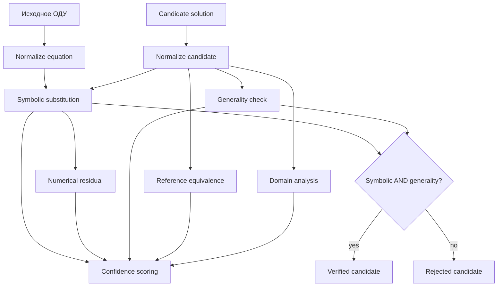

# Алгоритм верифицируемого решения DiffSolver

## 1. Назначение документа

Этот документ подробно описывает собственную алгоритмическую часть DiffSolver.

Главная конкурентная особенность проекта — не наличие SymPy или LLM сами по себе, а **комбинированный алгоритм**, который:

1. получает математические решения из детерминированных и генеративных источников;
2. приводит их к единому машинному представлению;
3. независимо проверяет математическую корректность;
4. формирует объяснимый confidence score;
5. позволяет LLM исправить собственный неверный ответ на основании машинной диагностики;
6. при multi-solver проверке использует consensus только как дополнительное свидетельство после correctness gate.

Ключевой принцип:

> **Consensus не определяет истинность. Истинность определяется математической проверкой.**

---

## 2. Проблема, которую решает алгоритм

Использование LLM для математики имеет несколько типичных failure modes:

- правильное объяснение с неправильным финальным ответом;
- неверное преобразование в середине решения;
- потеря произвольной константы;
- решение частного случая вместо общего;
- корректный ответ, представленный в форме, отличной от reference;
- syntactically broken JSON;
- убедительно написанный, но математически неверный текст;
- несколько моделей могут независимо повторить одну и ту же ошибку.

Поэтому нельзя считать ответ корректным на основании:

- уверенного natural-language тона;
- совпадения строк;
- большинства голосов;
- numerical check в одной точке;
- самого факта, что ответ получен от известной модели.

DiffSolver отделяет **генерацию** от **верификации**.

---

## 3. Термины

### Equation

Исходное ОДУ пользователя.

Пример:

```text
y.diff(x) - y = 0
```

### Candidate

Предлагаемое решение конкретного solver/provider.

Например:

```text
C1*exp(x)
```

### Reference

Эталонное expression, полученное отдельным SymPy `dsolve` внутри Verification Engine.

Reference используется для equivalence diagnostics и для направления AI explanation, но candidate correctness всё равно проверяется подстановкой в исходное ОДУ.

### Residual

Для уравнения

```text
LHS = RHS
```

строится:

```text
F = LHS - RHS
```

После подстановки candidate получается residual функции решения.

### Verified candidate

Кандидат, прошедший обязательные hard checks.

### Confidence score

Агрегированная объяснимая оценка дополнительных независимых сигналов. Она **не заменяет hard gate**.

### Consensus support

Доля verified candidates, попавших в одно эквивалентное семейство.

---

## 4. Общая схема алгоритма



---

# Часть I. Нормализация

## 5. Нормализация исходного уравнения

`SolutionNormalizer.parse_equation()` принимает строку и преобразует её к SymPy structure.

### 5.1 Синтаксическое ограничение

Уравнение должно содержать ровно один знак:

```text
=
```

Это устраняет неоднозначный parse верхнего уровня.

### 5.2 Математическая модель

Для independent variable `x` backend создаёт:

```text
x = Symbol

y = Function('y')(x)
```

### 5.3 Residual representation

Если:

```text
L(x, y, y', ...) = R(x, y, y', ...)
```

то:

```text
F(x, y, y', ...) = L - R
```

Correct solution должно удовлетворять:

```text
F = 0
```

после подстановки.

### 5.4 ODE order

Используется SymPy `ode_order()`.

Если определить order не удалось, текущая fallback логика использует минимум `1`.

Order далее нужен для generality check.

### 5.5 Parameters

Free symbols исходного residual, кроме independent variable, считаются equation parameters.

Они отделяются от произвольных integration constants candidate.

---

## 6. Нормализация кандидата

LLM обязана вернуть `solution_expression`.

Пример:

```text
C1*exp(x)
```

а не:

```text
y(x) = C_1 e^x
```

### 6.1 Допустимый assignment format

Если candidate всё же содержит:

```text
y = C1*exp(x)
```

normalizer берёт правую часть.

### 6.2 Power syntax

```text
^
```

заменяется на:

```text
**
```

### 6.3 Произвольные константы

Parser явно объявляет:

```text
C
C1
C2
...
C20
```

### 6.4 Canonicalization

К expression применяются:

```text
together
trigsimp
powsimp
factor
simplify
```

Цель — снизить влияние формы записи без намеренного изменения solution family.

---

# Часть II. Symbolic verification

## 7. Формальная идея

Пусть исходное ОДУ имеет вид:

```text
F(x, y, y', y'', ..., y^(n)) = 0
```

и solver предложил:

```text
y = g(x)
```

Verifier строит:

```text
R(x) = F(x, g(x), g'(x), g''(x), ..., g^(n)(x))
```

После этого выполняется symbolic simplification.

Кандидат проходит symbolic stage тогда и только тогда, когда residual тождественно равен нулю в поддерживаемом SymPy representation:

```text
simplify(R(x)) = 0
```

---

## 8. Почему symbolic verification — главный gate

Численная проверка может случайно пройти:

- в специальных точках;
- при неудачном выборе constants;
- из-за cancellation;
- в частном случае;
- при insufficient samples.

Symbolic residual проверяет математическую структуру напрямую.

Поэтому в текущем алгоритме:

```text
symbolic_passed
```

обязателен.

---

## 9. Пример

Исходное ОДУ:

```text
y' - y = 0
```

Candidate:

```text
C1*exp(x)
```

После подстановки:

```text
d/dx(C1*exp(x)) - C1*exp(x)
```

получаем:

```text
C1*exp(x) - C1*exp(x) = 0
```

Symbolic stage passed.

Если candidate:

```text
C1*x
```

то residual:

```text
C1 - C1*x
```

не является тождественным нулём.

Candidate rejected.

---

# Часть III. Numerical verification

## 10. Роль numerical stage

Numerical verifier — **независимое вторичное свидетельство**.

Он полезен для:

- diagnostics;
- дополнительной проверки после symbolic transformations;
- detecting suspicious simplification outcomes;
- confidence scoring.

Он не является hard truth source.

---

## 11. Sample strategy

Используются точки:

```text
-4
-3
-2
-1
-0.5
0.5
1
2
3
4
```

Ноль намеренно не является единственной центральной точкой и часто исключается из-за возможных singularities.

---

## 12. Integration constants

Candidate arbitrary constants тестируются с несколькими значениями:

```text
0.731
1.337
```

Это снижает вероятность проверки только специального частного случая.

---

## 13. Equation parameters

Параметры исходного уравнения получают deterministic value:

```text
1.11111111
```

---

## 14. Допуск

```text
TOLERANCE = 1e-8
```

Проверяется абсолютная величина residual.

---

## 15. Minimum evidence

После final stabilization введён обязательный минимум:

```text
MIN_CHECKED_POINTS = 6
```

Если из-за singularities/ошибок удалось проверить слишком мало точек, numerical stage считается не пройденным даже при нулевом максимальном residual среди доступных samples.

Это защищает от ложноположительного вывода на недостаточной выборке.

---

# Часть IV. Generality check

## 16. Зачем проверять произвольные константы

Для общего решения ОДУ порядка `n` ожидается достаточное количество независимых arbitrary constants.

Пример:

```text
y'' + y = 0
```

Общее решение должно содержать две constants, например:

```text
C1*cos(x) + C2*sin(x)
```

Решение:

```text
cos(x)
```

может удовлетворять уравнению, но является только частным решением.

---

## 17. Реализованное правило

Из free symbols candidate исключаются:

- independent variable;
- equation parameters.

Оставшееся количество candidate constants сравнивается с order.

Условие:

```text
constants_found >= equation_order
```

---

## 18. Hard correctness gate

Финальная логика:

```text
verified = symbolic_passed AND generality_passed
```

То есть даже идеально нулевой residual частного решения не даёт статус общего verified solution, если не хватает произвольных констант.

---

# Часть V. Equivalence checking

## 19. Проблема эквивалентных форм

Одно семейство может быть записано по-разному.

Например:

```text
C1*exp(x)
```

и условно:

```text
exp(x + C2)
```

могут описывать одно семейство после перенормировки arbitrary constant.

Простое сравнение строк непригодно.

---

## 20. Canonical constant renaming

Equivalence checker приводит arbitrary constants к унифицированным именам вида:

```text
K1, K2, ...
```

После этого пытается symbolic simplify difference.

---

## 21. Уровни результата

### Exact canonical equivalence

Если difference упрощается до 0:

```text
confidence = 1.0
```

### Compatible solution family

Если оба выражения имеют достаточную структуру general solution и сопоставимое число constants, relation может считаться совместимой family:

```text
confidence = 0.7
```

### Mismatch

```text
confidence = 0
```

---

## 22. Почему equivalence не является hard gate

Candidate может быть корректным общим решением, но не совпасть с canonical reference representation из-за:

- branch choices;
- constant transformations;
- identity transformations;
- SymPy simplification limitations.

Поэтому correctness определяется исходным ОДУ, а reference equivalence — дополнительный диагностический signal.

---

# Часть VI. Domain validation

## 23. Задача

Решение может вводить singularities.

Verifier сравнивает:

- singularities исходного equation context;
- singularities candidate expression.

Дополнительные singularities формируют warnings.

---

## 24. Почему domain warning не reject

Многие ОДУ имеют локально корректные solution families на интервалах, разделённых особенностями.

Автоматический отказ по любой singularity дал бы ложные отрицания.

Текущая policy:

- no extra warnings -> confidence 1.0;
- extra singularities -> confidence 0.8 + diagnostics;
- domain stage сам по себе не меняет `verified` на false.

---

# Часть VII. Confidence scoring

## 25. Компоненты

Веса:

| Компонент | Вес |
|---|---:|
| symbolic | 0.45 |
| numerical | 0.20 |
| generality | 0.15 |
| equivalence | 0.10 |
| domain | 0.10 |

Сумма:

```text
1.00
```

---

## 26. Формула

Для component confidence `c_i` и weight `w_i`:

```text
Score = Σ(w_i * c_i) / Σ(w_i)
```

В текущей конфигурации denominator равен 1.

Итог clamp:

```text
0 <= Score <= 1
```

---

## 27. Почему score и verified — разные вещи

Это фундаментальное решение.

Нельзя делать:

```text
verified = score > 0.8
```

Потому что, например, mathematically wrong candidate мог бы получить:

- хороший numerical случайно;
- хорошую domain оценку;
- consensus support;
- structural similarity.

Правильно:

```text
verified = exact correctness gate
score = качество/согласованность диагностических свидетельств
```

---

# Часть VIII. AI self-correction

## 28. Назначение

LLM используется для подробного объяснения.

Но вместо показа первого ответа система запускает:

```text
generate -> verify -> feedback -> regenerate
```

---

## 29. Эталон перед генерацией

`AIExplanationService` сначала вызывает:

```python
verifier.solve_reference(equation, variable)
```

LLM получает verified target expression.

Это превращает задачу из:

```text
«угадай решение»
```

в:

```text
«подробно выведи математически эквивалентное решение»
```

---

## 30. LLM response contract

```json
{
  "steps": [
    {"type": "text", "content": "..."},
    {"type": "math", "content": "..."}
  ],
  "solution": "LaTeX",
  "solution_expression": "C1*exp(x)"
}
```

### `steps`

Человекочитаемое объяснение.

### `solution`

Frontend-oriented LaTeX.

### `solution_expression`

Backend-oriented SymPy syntax.

Verifier проверяет именно последнее поле.

---

## 31. Feedback generation

Если candidate invalid, сервис передаёт модели:

```text
candidate expression
reference expression
confidence score
symbolic residual
symbolic passed
numerical passed
max numerical residual
generality status
constants found
equivalence relation
domain warnings
explicit rejection reasons
```

Таким образом self-correction опирается на **машинную диагностику**, а не на просьбу «попробуй ещё раз».

---

## 32. Bounded correction loop

```text
MAX_ATTEMPTS = 3
```

Псевдокод:

```text
reference = solve_reference(equation)
feedback = none

for attempt in 1..3:
    candidate = LLM(equation, reference, feedback)
    verification = verify(candidate)

    if verification.verified:
        return candidate + verification

    feedback = diagnostics(candidate, verification)

raise AIExplanationError
```

---

## 33. Почему цикл ограничен

Без bound возможны:

- бесконечный request;
- GPU starvation;
- server thread exhaustion;
- cost explosion для cloud LLM;
- poor UX.

Fixed upper bound делает runtime behaviour предсказуемым.

---

# Часть IX. Consensus algorithm

## 34. Цель

Пользователь может запросить независимую проверку несколькими методами.

Задача — не «выбрать ответ большинства», а:

1. получить независимые candidates;
2. проверить каждый;
3. объединить эквивалентные **валидные** семейства;
4. использовать agreement как дополнительную уверенность;
5. выбрать лучший verified candidate.

---

## 35. Providers

Текущий default set:

```text
SymPy
Ollama
OpenAI
DeepSeek
```

OpenAI/DeepSeek optional.

---

## 36. Параллельный запуск

Providers запускаются в `ThreadPoolExecutor`.

Это означает, что network/model latency складывается ближе к максимуму среди parallel calls, а не к их сумме.

---

## 37. Provider availability

Перед solve provider может сообщить:

```text
available = false
```

Примеры:

- нет API key;
- Ollama offline;
- требуемая локальная модель не установлена.

Такой provider получает status `unavailable`, но consensus продолжает работу.

---

## 38. Независимая верификация каждого кандидата

После generation каждый candidate проходит **тот же MultiStageVerificationEngine**.

То есть OpenAI, DeepSeek, Ollama и SymPy сравниваются через одинаковый verification contract.

Invalid candidate получает:

```text
status = invalid
```

---

## 39. Главное правило consensus

Группировать разрешено только:

```text
verified candidates
```

Это предотвращает ошибку:

```text
Ollama wrong
OpenAI wrong
DeepSeek same wrong
SymPy correct
```

Наивное majority vote выбрало бы wrong.

DiffSolver:

```text
3 wrong candidates -> fail verification -> rank 0
1 correct candidate -> verified -> eligible
```

Correct candidate выигрывает.

---

## 40. Grouping

Verified candidates группируются по математической equivalence.

Для группы:

```text
support = group_size / total_verified_candidates
```

Пример:

```text
verified candidates = 3
same family group = 2
support = 2/3 ≈ 0.667
```

---

## 41. Consensus reached

Current summary flag:

```text
consensus_reached = top_group_support > 0.5
```

Это означает большинство среди **verified** candidates.

---

## 42. Ranking

Для verified candidate:

```text
Rank = 0.8 * VerificationScore
     + 0.2 * ConsensusSupport
```

### Почему 80/20

Математическая проверка должна доминировать.

Consensus — полезное независимое свидетельство, но не основной источник правильности.

### Invalid candidate

```text
Rank = 0
```

независимо от support.

---

## 43. Выбор best candidate

После ranking берётся первый candidate, у которого:

```text
verified == true
```

Если ни один candidate не verified:

```text
best_candidate = null
```

Система не обязана выдавать ложный «лучший ответ».

---

# Часть X. Инварианты алгоритма

## 44. Инвариант 1: invalid majority не может выиграть

Никакое количество одинаковых неверных candidates не заменяет symbolic correctness.

---

## 45. Инвариант 2: score не меняет truth state

Высокий confidence не делает symbolic-invalid solution verified.

---

## 46. Инвариант 3: частное решение не считается общим

Если arbitrary constants недостаточно для order, generality gate fails.

---

## 47. Инвариант 4: AI не показывается как verified до проверки

Natural-language explanation не является доказательством correctness.

---

## 48. Инвариант 5: self-correction bounded

Не более трёх model attempts на explain request.

---

## 49. Инвариант 6: provider failure isolated

Недоступность одного optional provider не должна отменять результаты остальных.

---

# Часть XI. Stabilization решений

## 50. JSON parsing LLM

Ранее попытка извлечения JSON через ручной brace counting могла ломаться на LaTeX:

```text
\left\{ ... \right\}
```

потому что `{}` внутри JSON string ошибочно принимались за structural braces.

Final implementation использует:

```python
json.JSONDecoder().raw_decode(...)
```

что учитывает JSON string semantics.

---

## 51. Offline Ollama

До generation consensus делает short healthcheck с отдельным малым timeout.

Цель — не ждать большой `OLLAMA_TIMEOUT`, если локальный runtime вообще выключен.

---

## 52. Cloud provider timeout

OpenAI-compatible providers имеют configurable bounded timeout/retry.

Это предотвращает indefinite external dependency wait.

---

## 53. Multi-branch SymPy

Если `dsolve` возвращает несколько branches:

- все `Eq` выделяются;
- первая используется как deterministic canonical reference;
- остальные сохраняются для diagnostics.

Это текущий pragmatic policy, а не утверждение, что первая branch всегда единственно значимая.

---

# Часть XII. Что алгоритм гарантирует и чего не гарантирует

## 54. Гарантируемые свойства в рамках поддерживаемой модели

При успешном `verified=true` backend подтверждает, что:

- candidate удалось parse в поддерживаемое SymPy expression;
- candidate symbolic substitution удовлетворяет исходному ОДУ;
- candidate имеет достаточное количество произвольных constants для заявленного ODE order.

Также доступны secondary diagnostics.

---

## 55. Что не является абсолютной математической гарантией

Проект не является универсальным theorem prover.

Ограничения:

- SymPy parsing/simplification имеет собственные границы;
- implicit solutions поддерживаются ограниченно;
- branch/domain subtleties могут требовать ручного математического анализа;
- independence arbitrary constants проверяется по количеству symbols, а не полным differential-algebraic proof;
- domain stage выдаёт warnings, а не полный proof области определения;
- equation class ориентирован на `y(x)`;
- pathological symbolic expressions могут быть computationally expensive.

Поэтому `verified` следует понимать как:

> успешно прошёл формализованные проверки системы для поддерживаемого класса входов.

---

# Часть XIII. Почему это является собственной алгоритмической составляющей

## 56. Использование готовых компонентов

Проект сознательно использует готовые инструменты:

- SymPy;
- Ollama;
- OpenAI-compatible APIs.

Но эти компоненты не реализуют совместно product policy DiffSolver.

---

## 57. Собственная логика проекта

Собственный слой определяет:

- как нормализовать heterogeneous solver outputs;
- какие проверки independent;
- какие checks являются hard gates;
- как учитывать order/generality;
- как формировать confidence;
- как строить feedback для self-correction;
- когда прекратить correction loop;
- как изолировать provider failures;
- как группировать verified candidates;
- как вычислять consensus support;
- как ранжировать candidates;
- как не допустить majority-of-wrong answers.

Именно комбинация этих решений образует алгоритмическую особенность проекта.

---

# Часть XIV. Возможные дальнейшие улучшения

## 58. Step-level verification

Сейчас verifier проверяет machine-readable итог candidate.

Следующий уровень — проверять математическую эквивалентность каждого шага AI derivation.

Для этого потребуются structured expressions на каждом step.

---

## 59. Adaptive sampling

Numerical verifier можно улучшить:

- автоматически выбирать points из domain intervals;
- избегать singularities до evaluation;
- использовать randomized/property-based values;
- тестировать parameter combinations.

---

## 60. Better constant-family equivalence

Можно добавить symbolic transformations arbitrary constants и более строгую проверку equality solution sets.

---

## 61. Initial/boundary conditions

Current pipeline фокусируется на общем решении.

Для IVP/BVP потребуется отдельный stage:

```text
general solution
↓
apply conditions
↓
constant solving
↓
condition verification
```

---

## 62. Uncertainty calibration

Текущие weights инженерно фиксированы.

Можно собрать benchmark dataset и статистически откалибровать веса по empirical error rates.

---

## 63. Provider reliability history

Можно учитывать историческую точность provider для конкретных классов ОДУ, но только как ranking signal после correctness gate.

---

## 64. Async consensus

Для тяжёлых моделей consensus можно вынести в background jobs и отдавать progressive provider results.

---

## 65. Связанные документы

- [README](../README.md)
- [Архитектура](architecture.md)
- [Кодовая база](codebase.md)
- [Тестирование](testing.md)
