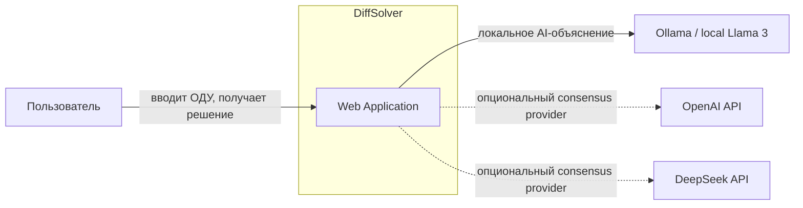
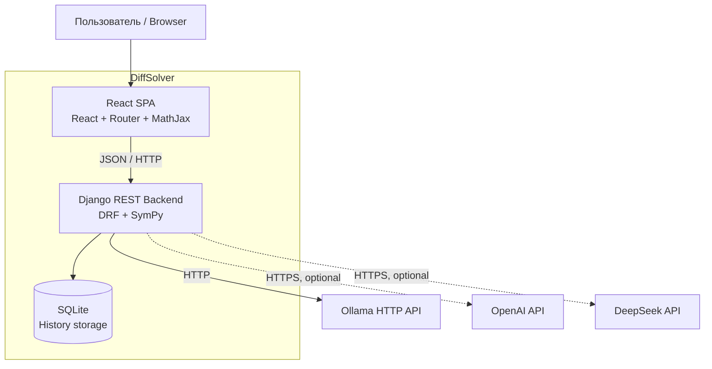
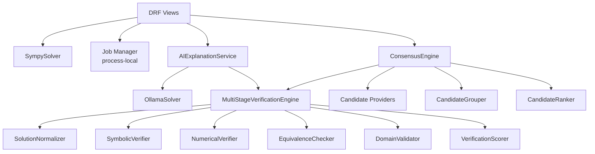
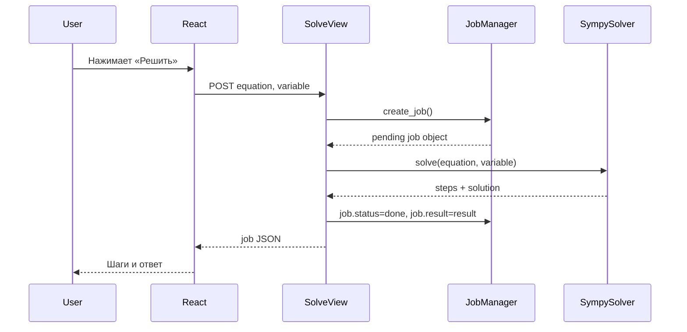
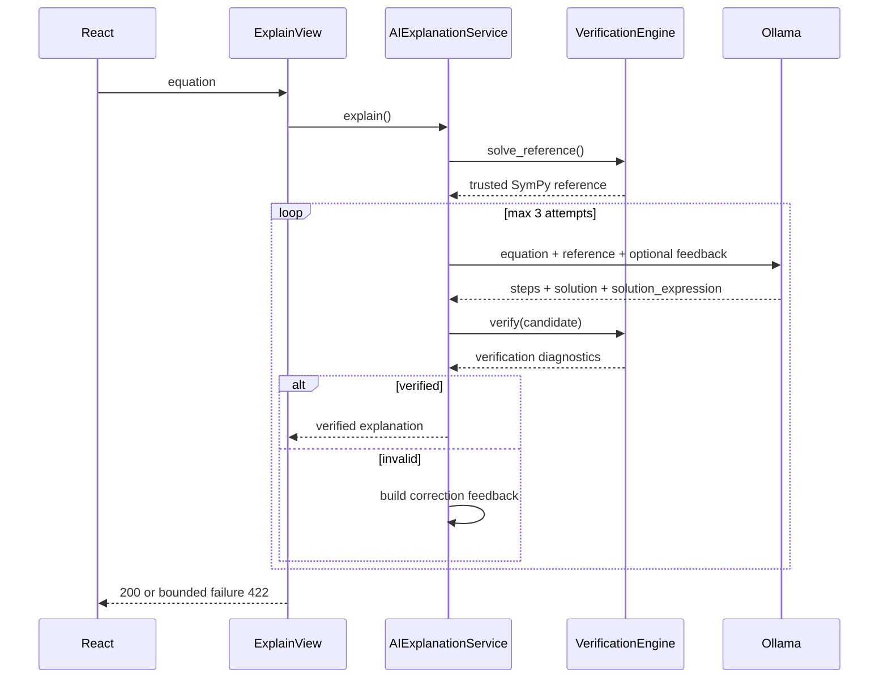
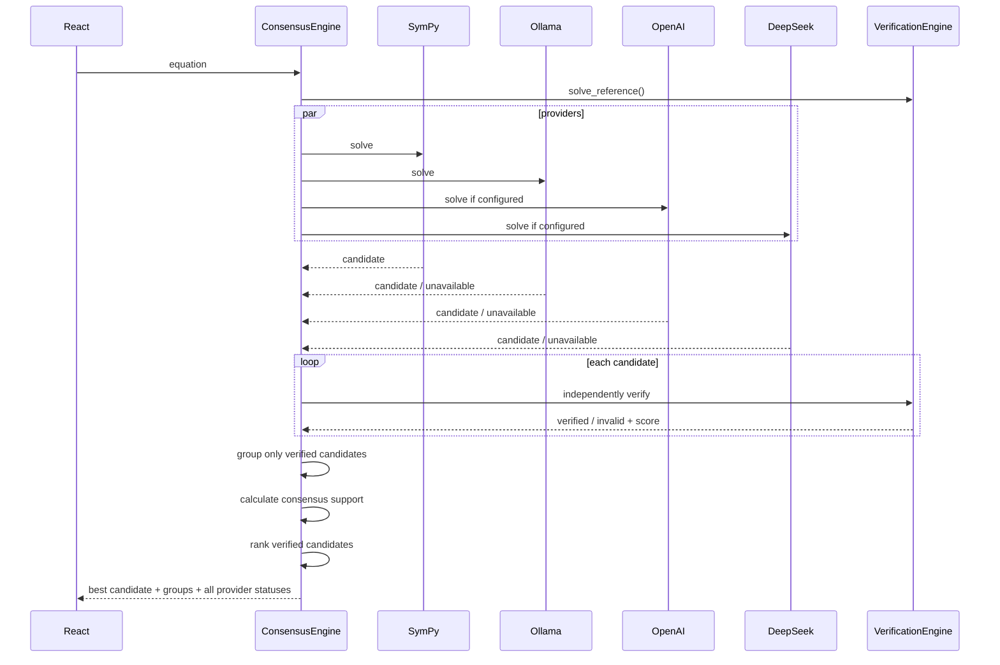
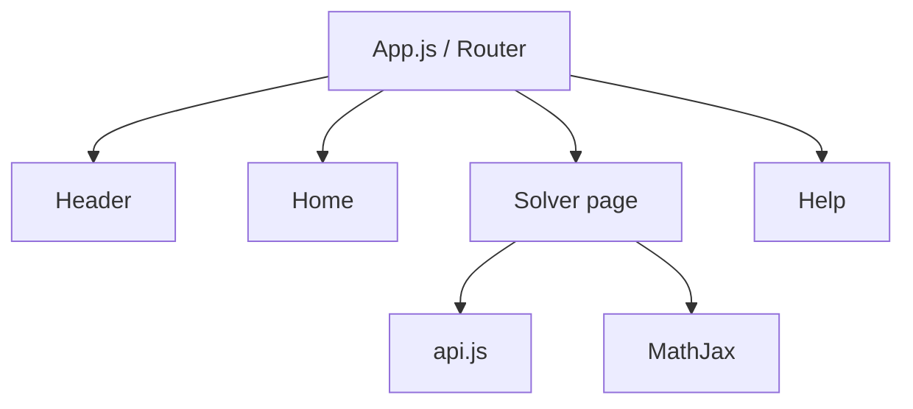
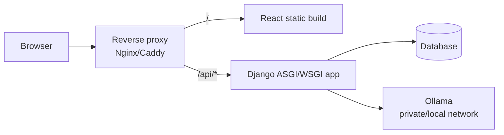

# Архитектура DiffSolver

## 1. Назначение документа

Этот документ описывает архитектуру DiffSolver целиком: границы системы, frontend/backend, внешние зависимости, математический pipeline, AI, consensus, хранение данных, обработку ошибок, конфигурацию, параллелизм и ограничения.

Документ рассчитан на читателя, который впервые видит проект.

---

## 2. Архитектурная идея

DiffSolver построен вокруг принципа **verified-first**:

1. обычное решение должно быть быстрым и детерминированным;
2. генеративная модель не считается доверенным математическим источником;
3. AI подключается отдельно, когда пользователь хочет подробное объяснение;
4. любой AI-кандидат должен предоставить machine-readable математическое выражение;
5. это выражение независимо проверяется backend;
6. если AI ошибся, backend возвращает модели диагностический feedback и разрешает ограниченное число повторных попыток;
7. при сравнении нескольких solver'ов межмодельное согласие используется только после независимой проверки математической корректности.

Следствие: **правильность не определяется голосованием моделей**.

---

## 3. C4 Level 1 — системный контекст



### Актор

**Пользователь** вводит дифференциальное уравнение, получает быстрый SymPy-ответ и при необходимости запускает AI-объяснение или независимую проверку несколькими методами.

### Внешние системы

- **Ollama** — локальный runtime LLM. По умолчанию используется модель `llama3`.
- **OpenAI API** — опциональный provider для consensus.
- **DeepSeek API** — опциональный OpenAI-compatible provider для consensus.

Отсутствие облачных API-ключей не ломает основной сценарий.

---

## 4. C4 Level 2 — контейнеры



### 4.1 React frontend

Ответственность:

- маршрутизация пользовательских страниц;
- ввод и первичная UX-валидация уравнения;
- вызов REST API;
- независимые loading/error states для solve, AI и consensus;
- рендер LaTeX через MathJax;
- отображение confidence, количества AI-попыток, solver statuses и consensus support.

Frontend **не реализует математическую проверку**. Он отображает решения и diagnostics, рассчитанные backend.

### 4.2 Django REST backend

Ответственность:

- HTTP API;
- сериализация/валидация входных payloads;
- SymPy solving;
- AI orchestration;
- математическая верификация;
- self-correction;
- multi-provider consensus;
- история решений;
- error/status mapping.

Backend является доверенной вычислительной границей системы.

### 4.3 SQLite

Используется Django-приложением `history` для модели `Solution`.

Поля:

- исходное уравнение;
- финальное решение;
- JSON шагов;
- дата создания.

Важно: history subsystem и API существуют, но текущий быстрый `SolveView` напрямую решает через `SympySolver` и не обязан автоматически сохранять каждую задачу в `Solution`. Поэтому storage и solve pipeline сейчас архитектурно развязаны.

### 4.4 LLM providers

Они рассматриваются как **недоверенные генераторы кандидатов**, а не валидаторы.

---

## 5. C4 Level 3 — backend-компоненты



---

## 6. Публичные backend use cases

### 6.1 Быстрое решение

Endpoint:

```text
POST /api/solve/
```

Pipeline:



Характеристики:

- синхронный HTTP request;
- всегда SymPy;
- не ждёт LLM;
- process-local `job_manager` используется как простой state envelope;
- при математической/парсерной ошибке возвращается HTTP 422.

### Почему `job_manager` не является очередью

`job_manager.py` содержит обычный Python `dict` в памяти процесса.

Он **не** предоставляет:

- worker processes;
- durable queue;
- Redis/RabbitMQ;
- persistence;
- retry scheduler;
- distributed task state.

После перезапуска процесса jobs исчезают. Поэтому термин «job» здесь означает lightweight request state, а не background task.

---

## 7. AI explanation flow

Endpoint:

```text
POST /api/explain/
```



### 7.1 Почему AI получает эталон

Задача LLM — не независимо «угадать» финальный ответ, а объяснить путь к математически эквивалентному уже найденному решению.

Это снижает вероятность галлюцинации, но не устраняет её полностью — поэтому отдельный verifier всё равно обязателен.

### 7.2 Machine-readable контракт

LLM обязана вернуть:

```json
{
  "steps": [],
  "solution": "LaTeX",
  "solution_expression": "C1*exp(x)"
}
```

`solution_expression` предназначен исключительно для backend-проверки и использует синтаксис SymPy, а не LaTeX.

### 7.3 Self-correction

Если проверка провалилась, AI получает:

- свой предыдущий candidate;
- reference expression;
- confidence score;
- symbolic residual;
- numerical residual status;
- информацию о произвольных константах;
- equivalence relation;
- domain warnings;
- причины отклонения.

Максимальное число попыток — `3`.

Это bounded loop: пользовательский request не может уйти в бесконечную генерацию.

---

## 8. Verification Engine

`MultiStageVerificationEngine` — независимое математическое ядро оценки кандидата.

Компоненты:

```text
SolutionNormalizer
      ↓
SymbolicVerifier ──────────────┐
NumericalVerifier ─────────────┤
Generality check ──────────────┼─> VerificationScorer
EquivalenceChecker ────────────┤
DomainValidator ───────────────┘
```

Критически важно:

```text
verified = symbolic_passed AND generality_passed
```

Confidence score **не может** сделать неправильный кандидат валидным.

Подробная математика описана в [algorithm.md](algorithm.md).

---

## 9. Consensus flow

Endpoint:

```text
POST /api/consensus/
```



### 9.1 Параллельность

Providers запускаются через `ThreadPoolExecutor`.

Максимум worker threads:

```text
min(number_of_providers, 4)
```

Это сокращает wall-clock time при нескольких удалённых providers.

### 9.2 Availability

Provider может иметь состояния:

- `ok`;
- `invalid`;
- `unavailable`;
- `error`.

OpenAI/DeepSeek без API key являются `unavailable`, а не причиной отказа всей операции.

Ollama перед длинным запросом проходит короткий healthcheck.

---

## 10. Trust model

Система разделяет источники по уровню доверия.

### Доверенная математическая инфраструктура

- SymPy parsing;
- SymPy differentiation;
- symbolic residual calculation;
- verification rules;
- scoring implementation.

### Недоверенные данные

- пользовательская строка уравнения;
- LLM text;
- LLM `solution_expression`;
- ответы внешних providers;
- HTTP/network availability.

Любой LLM `solution_expression` проходит тот же normalizer и verifier.

---

## 11. Frontend-компоненты



### Routes

```text
/       Home
/solve  Solver
/help   Help
```

### Solver page state

У страницы раздельные состояния:

- quick solve;
- AI explanation;
- consensus verification.

Поэтому долгий AI request не смешивается с ошибками или loading status обычного SymPy solve.

---

## 12. API boundary

Frontend по умолчанию использует:

```text
http://localhost:8000/api
```

Переопределение:

```env
REACT_APP_API_URL=...
```

Backend development CORS разрешает React-origin `http://localhost:3000` в текущей конфигурации.

---

## 13. Error model

### Solve

Ошибки пользовательского уравнения/решения:

```text
HTTP 422
```

### Explain

Не удалось получить проверенный AI-result после bounded attempts:

```text
HTTP 422
```

Service/provider failure:

```text
HTTP 503
```

### Consensus

Катастрофический failure engine:

```text
HTTP 503
```

При этом individual provider failure обычно попадает в response как status конкретного кандидата и не рушит весь consensus request.

---

## 14. Конфигурация внешних providers

`backend/config/settings.py` вычисляет `BASE_DIR` как корень `trposite/` и загружает `trposite/.env`. Provider-specific параметры также могут читаться напрямую из process environment через `os.getenv()`.

### Ollama

```env
OLLAMA_BASE_URL=http://localhost:11434
OLLAMA_MODEL=llama3
OLLAMA_TIMEOUT=180
OLLAMA_HEALTHCHECK_TIMEOUT=1.5
```

### OpenAI-compatible consensus providers

```env
OPENAI_API_KEY=
DEEPSEEK_API_KEY=
DEEP_SEEK_API_KEY=
LLM_PROVIDER_TIMEOUT=45
LLM_PROVIDER_MAX_RETRIES=1
```

Cloud providers опциональны.

---

## 15. Persistence architecture

### Django database

Current development backend использует SQLite.

`history.Solution` — persistent модель.

### Process-local state

`solver.services.job_manager.jobs` — обычный in-memory dictionary.

Не следует путать два типа state:

| State | Lifetime | Storage |
|---|---|---|
| Solution history | persistent | Django database |
| solve job envelope | до перезапуска процесса | Python memory |

---

## 16. Deployment topology

Текущий monorepo не требует, чтобы React обязательно отдавался Django.

Рекомендуемая production-топология:



Для production необходимо отдельно решить:

- `DEBUG=False`;
- `ALLOWED_HOSTS`;
- production CORS/CSRF policy;
- secret storage;
- TLS;
- production WSGI/ASGI server;
- reverse proxy;
- database choice/backups;
- rate limiting;
- access policy к Ollama.

---

## 17. Почему AI не запускается автоматически

Если запускать LLM при каждом solve:

- увеличивается latency;
- расходуется GPU/CPU;
- растёт queue pressure;
- облачные providers создают стоимость;
- пользователь ждёт даже там, где SymPy уже дал достаточный ответ.

Поэтому UI использует progressive disclosure:

1. `Решить` — быстрый SymPy;
2. `Объяснить с помощью ИИ` — дополнительная функция;
3. `Проверить другими методами` — отдельная более дорогая независимая проверка.

---

## 18. Архитектурные инварианты

1. Обычный `/api/solve/` не выбирает solver по пользовательскому dropdown.
2. AI output не считается verified без backend verification.
3. Numerical check — secondary evidence, а не основной gate.
4. Consensus не определяет математическую истинность.
5. Invalid candidate имеет нулевой ranking contribution независимо от количества совпавших providers.
6. AI self-correction ограничен числом попыток.
7. Недоступность optional provider не должна ломать consensus целиком.
8. User-visible LaTeX и machine-readable `solution_expression` разделены.

---

## 19. Legacy и compatibility элементы

В кодовой базе остались элементы предыдущих этапов развития проекта:

- `SolverDispatcher`;
- отдельные ранние solver-классы;
- `solver_service.py`;
- `ResultView`;
- `job_manager.py`;
- `frontend/backend/` со старым Flask-прототипом.

Они не являются центральным маршрутом актуального frontend UX.

Главный runtime path сегодня:

```text
views.py
├── SympySolver
├── AIExplanationService
└── ConsensusEngine
```

Подробно различие описано в [codebase.md](codebase.md).

---

## 20. Точки расширения

### Новый solver provider

Рекомендуемый путь — реализовать `CandidateProvider` и добавить его в `build_default_providers()`.

### Новый verification signal

Добавить отдельный verifier и включить его результат в `checks`/`VerificationScorer`, сохраняя отдельный hard correctness gate.

### Настоящая background обработка

Заменить process-local jobs на Celery/RQ/Dramatiq + Redis/RabbitMQ и polling/SSE/WebSocket.

### Персистентная история каждого solve

Явно сохранить `Solution` в `SolveView` или вынести persistence в отдельный orchestration service.

### Другие классы математических задач

Потребуются:

- расширение parser/normalizer;
- отдельные correctness invariants;
- новые datasets;
- новые verification strategies.

---

## 21. Известные архитектурные ограничения

- Фокус — явные общие решения ОДУ вида `y = expression(x)`.
- Функция решения фиксирована как `y(x)`.
- Normalizer создаёт `C`, `C1`…`C20`; произвольные форматы констант LLM могут не распознаться.
- Для multibranch `dsolve` первая `Eq` является canonical reference.
- Domain warnings не являются hard rejection.
- HTTP AI/consensus requests остаются синхронными.
- `job_manager` не durable.
- History write не является обязательным шагом current solve path.
- SQLite подходит для development/учебного deployment, но не является обязательным production выбором.
- Нет authentication и user-specific state.

---

## 22. Связанные документы

- [Кодовая база](codebase.md)
- [Алгоритм](algorithm.md)
- [Тестирование](testing.md)
- [Главный README](../README.md)
